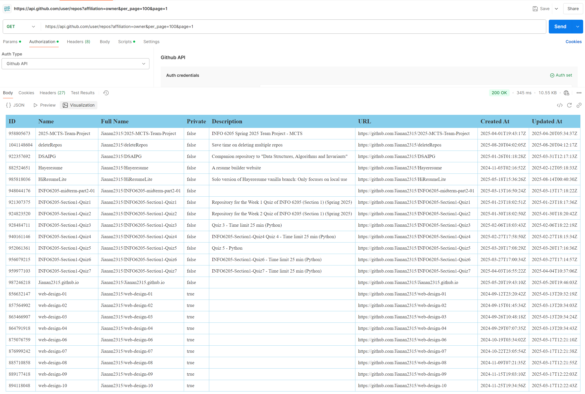
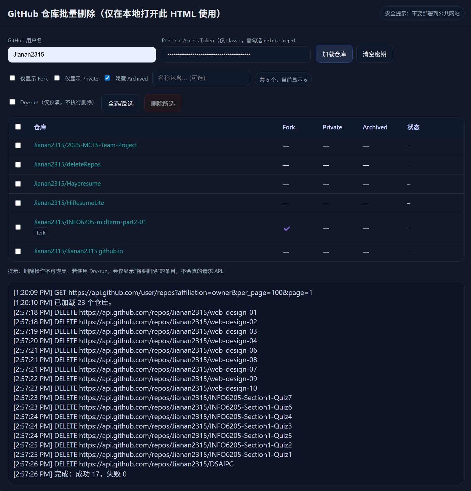

# deleteRepos
Save time on deleting multiple repos
基于官方API，勾选删除，不需要一个个点。
典型的要用时没心思弄也找不到，平时又用不着的项目。

# 9/6
1) 代码删减，能正常使用。虽然还能删减，但懒得弄了。
2) AI代码优势：模糊的简单需求都完成的很好。

# 8/24
1) 修改代码

# 8/23
1) huozhe

# 8/22
1) 重新排版
2) 修改代码

# 8/21
1) 把html内容分割成3份html, js, css。css微调。
2) 测试了API，没问题，下面2张截图
   - 
   - 
3) 调用的API：[List repositories for the authenticated user](https://docs.github.com/en/rest/repos/repos?apiVersion=2022-11-28#list-repositories-for-the-authenticated-user)
4) 删除时，需要输入YES确认，然后你会看到
   - 
5) 在GitHub端确认了，确实删除了。

# 8/20/2025
用gpt生成，然后修了报错。目前是可以抓取到所有项目。之后再测删除。

